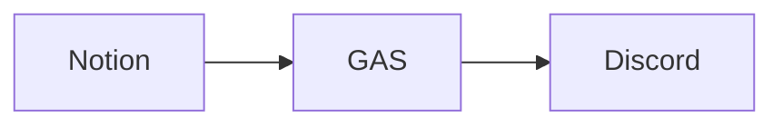

# はじめに

今回は、Notion WebHookでDIscord通知をやってみた記事になります。

## Notion WebHookとは

割と最近追加された機能で、DBのオートメーションアクションの一つです。

NotionのDBにデータが追加されたり更新されたりした際に任意のWebHookを叩くことができるという機能で、これからかなりの活躍が期待される機能となります。

https://www.notion.com/ja/help/webhook-actions

注意として、現在(2024/12/23)時点では有料プランのみで利用可能です。

## やりたいこと

- NotionのDBにデータが追加されたらDiscordに通知を飛ばす
- 通知の中にURLを含めて簡単に確認できるようにする

## 使用技術

- Notion
- Discord
- GAS(Google Apps Script)

以上の技術を使って実装していきます。
NotionのWebHookを叩いて、GASで処理をしてDiscordに通知を飛ばすという流れになります。



## GASの実装

GASの実装は以下のようになります。

```javascript
function doPost(e) {
  const json = JSON.parse(e.postData.getDataAsString()); // Notionからのデータを取得

  const url =
    'https://discord.com/api/webhooks/{discordで発行したWebHookのURL}'; // Discord WebHookのURL

  const message = 'DBにページが作成されました。→';
  const pageName = json.data.properties.name.title[0].text.content; // ページ名を取得
  const pageURL = json.data.url; // ページURLを取得

  const options = {
    method: 'POST',
    headers: {
      'Content-Type': 'application/json',
    },
    payload: JSON.stringify({ content: message + `[${pageName}](${pageURL})` }),
  }; // Discordに送信するデータ

  return UrlFetchApp.fetch(url, options); // Discordにデータを送信
}
```

## Notionの設定

データベースの⚡️アイコンから「オートメーション」を選択しWebHookを追加します。


日時のトリガーは「ページが作成されたとき」を選択しアクションは「WebHookを送信する」を選択します。

URLには先ほどのGASをWEBアプリとしてデプロイしたURLを入力します。
コンテンツでは今回使用するページ名プロパティの`name`を選択しています。

## 完成!

実際にNotionにページを追加するとDiscordに通知が飛ぶようになります。


ちゃんとクリックでNotionのページに遷移することもできます。

## おわりに

最後まで読んでいただきありがとうございます。

Notion WebHookはかなり便利な機能で、今後どんどん活用例が増えていくと思うのでウォッチしていきたいですね。

できれば無料プランでも使えるようになるといいなと思います🫠

## 参考

https://www.notion.com/ja/help/webhook-actions

https://hkob.hatenablog.com/entry/2024/12/06/050000

https://pwe-tech.com/post/gas-gcp-cloud-logging/
