# はじめに

今回は、Mermaidというツールを使って、ダイアグラムを描いてみたという記事になります。

普段書く記事の中にダイアグラムを書くことができれば、読み手にとってもわかりやすいかなと思い触ってみた次第です。

## Mermaidとは

MermaidとはMarkdownでグラフを作成できるダイアグラムツールです。
たとえば、以下のようなグラフを書くことができます。


また、シーケンス図を書いたり...

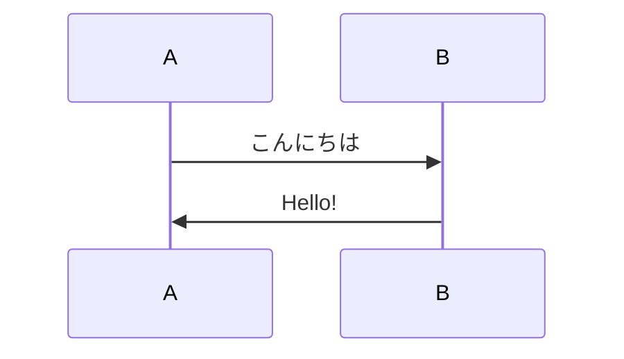

`gitGraph`という記法を使うことで、Gitのブランチ図も書くことができます。

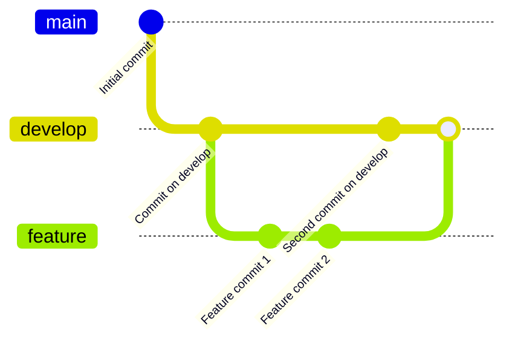

タイムラインやアーキテキチャ図だって書けちゃいます。

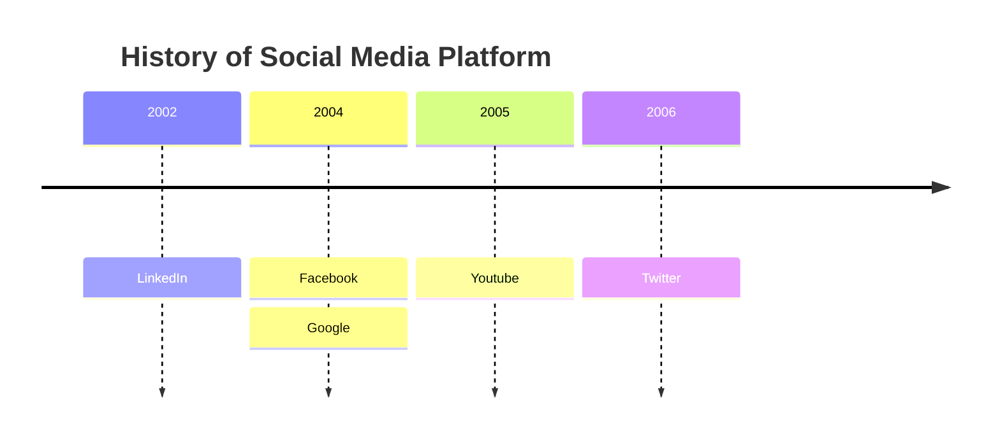
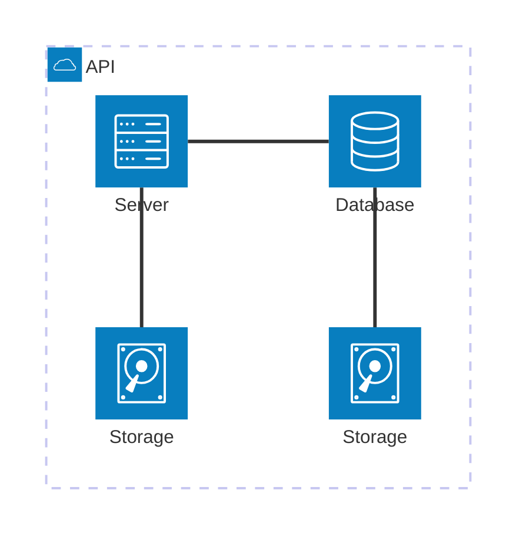

その他にさまざまな図を作成できますので、興味のある方は公式のリファレンスをご覧ください。

https://mermaid.js.org/intro/

## 書いてみる

今回は

- フローチャート
- シーケンス図

の2つについて、基本的な書き方を紹介していきます。

### フローチャート


冒頭のコチラは以下のようなテキストで書かれています。

```txt
graph LR
    A[起床] --> B[朝ごはん]
    B --> C[出勤]
    C --> D[昼ごはん]
    D --> E[退勤]
    E --> F[夕食]
    F --> G[就寝]
```

説明不要なほど単純な図ですが、簡単な解説をします。

最初に`graph(またはflowchart)`と書いて、その後に`LR`を書くことで、左から右へのフローチャートを書くことができます。

`LR`の他にも、`RL`、`TB`、`BT`があり、それぞれ左右、右左、上下、下上のフローチャートを書くことができます。

次に、`A[起床]`と書くことで、`A`というノードを作成し、ノードに`起床`というラベルを付けることができます。
`A --> B`と書くことで、`A`から`B`への矢印を作成することができます。

- 分岐 / ループ / ラベル付与

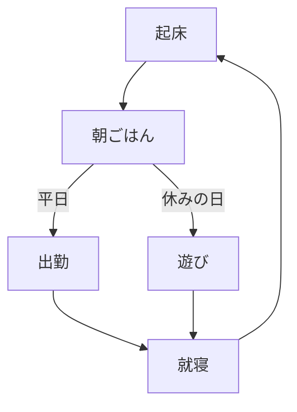

```txt
flowchart TB
    A[起床] --> B[朝ごはん]
    B -->|平日| C[出勤]
    B -->|休みの日| D[遊び]
    C --> E[就寝]
    D --> E
    E --> A
```

矢印に`|平日|`と書くことで、`B`から`C`への矢印に`平日`というラベルを付けています。

- ノードの図形を変更

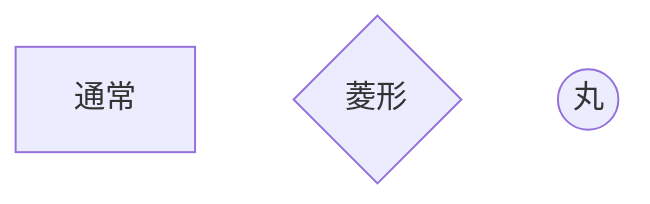

```txt
graph TD
    A[通常]
    B{菱形}
    C((丸))
```

- 矢印のスタイルを変更

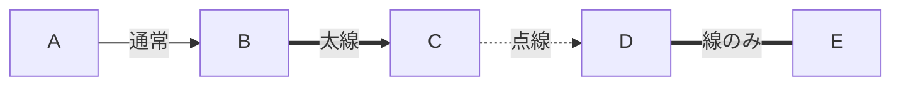

```txt
graph LR
    A -->|通常| B
    B ==>|太線| C
    C -.->|点線| D
    D ===|線のみ| E
```

### シーケンス図

ここからはシーケンス図を書いていきます。

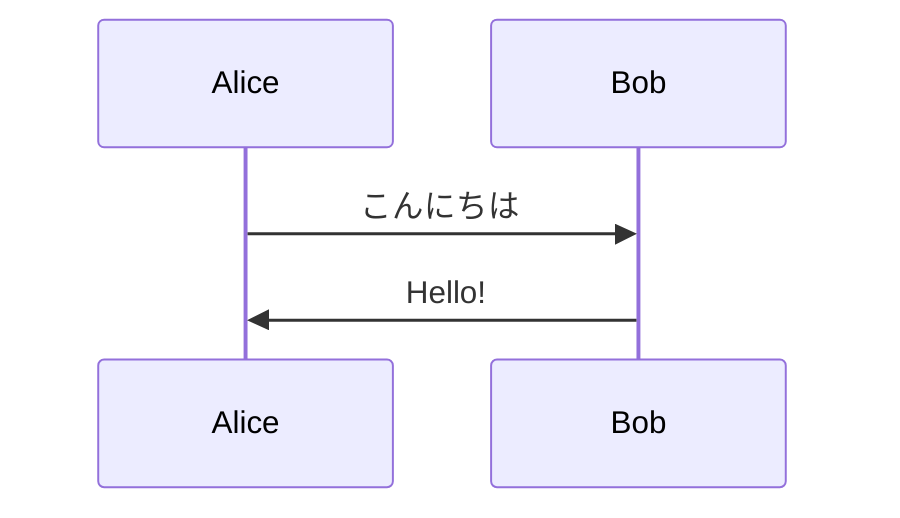

```txt
sequenceDiagram
    participant Alice
    participant Bob
    Alice->>Bob: こんにちは
    Bob->>Alice: Hello!
```

- パーティシパントを追加

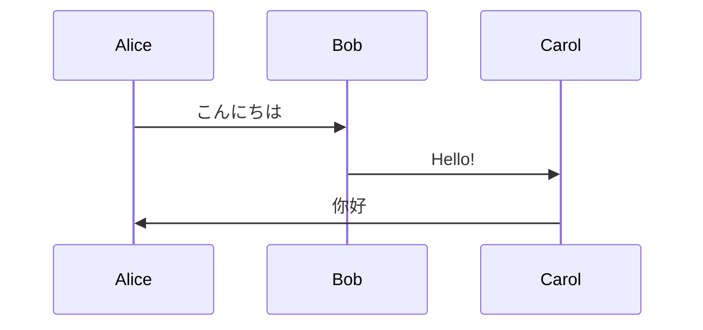

```txt
sequenceDiagram
    participant Alice
    participant Bob
    participant Carol
    Alice->>Bob: こんにちは
    Bob->>Carol: Hello!
    Carol->>Alice: 你好
```

- ループ

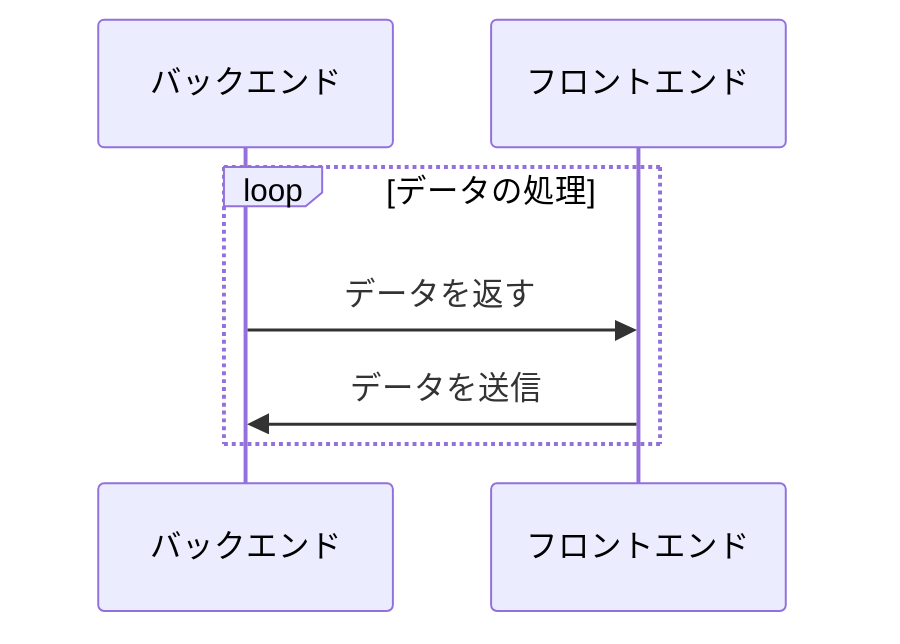

```txt
sequenceDiagram
    participant バックエンド
    participant フロントエンド
    loop データの処理
        バックエンド->>フロントエンド: データを返す
        フロントエンド->>バックエンド: データを送信
    end
```

- Alt(条件分岐)

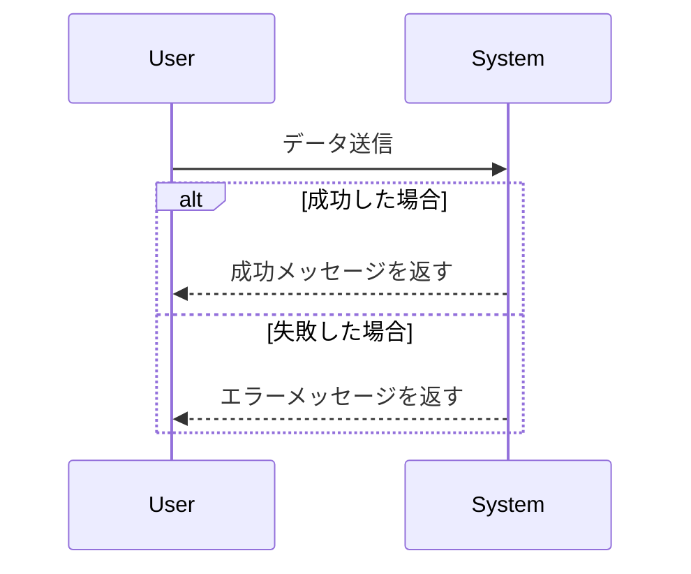

```txt
sequenceDiagram
    participant User
    participant System

    User->>System: データ送信
    alt 成功した場合
        System-->>User: 成功メッセージを返す
    else 失敗した場合
        System-->>User: エラーメッセージを返す
    end
```

- opt(オプション)
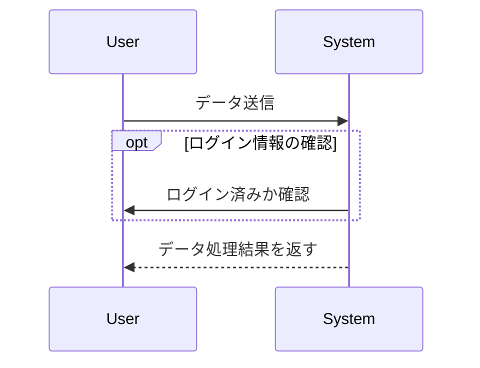

```
sequenceDiagram
    participant User
    participant System

    User->>System: データ送信
    opt ログイン情報の確認
        System->>User: ログイン済みか確認
    end
    System-->>User: データ処理結果を返す
```

- コメント

コメントを付与することができます。
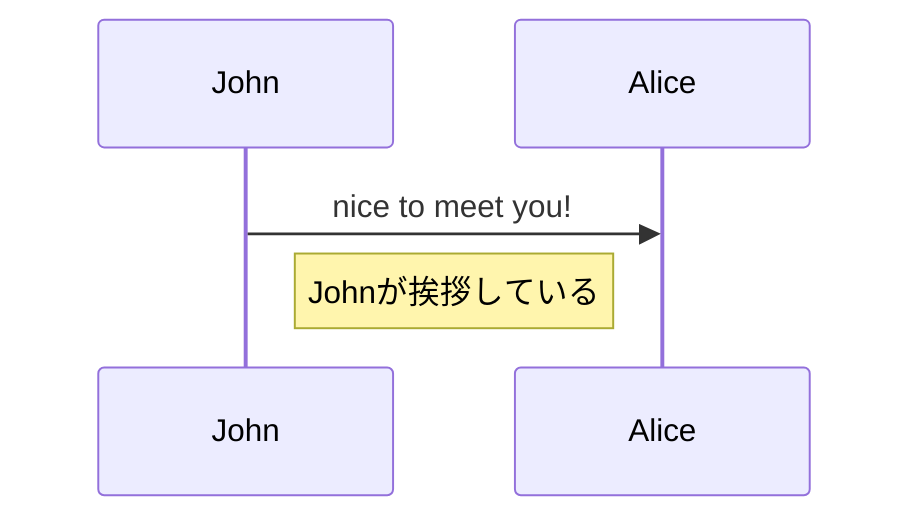

```txt
sequenceDiagram
    participant John
    participant Alice
    John->>Alice: nice to meet you!
    Note right of John: Johnが挨拶している
```

- エイリアス

エイリアスを使用することで、後で名前の変更をするときなどに一箇所の変更で済むようになります。

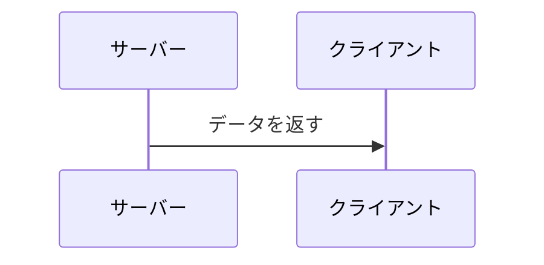

```txt
sequenceDiagram
    participant A as サーバー
    participant B as クライアント
    A->>B: データを返す
```

## おわりに

今回は、Mermaidというツールを使って、ダイアグラムを書いてみました。

今はまだ簡単な図しか書けませんが、これからどんどん使用して使いこなせるようになっていきたいと思います！

## 参考

https://mermaid.js.org/

https://qiita.com/run1000dori/items/90f91687cfe7ece50020

https://zenn.dev/kento_mm_ninw/articles/8b10afdbef306a
